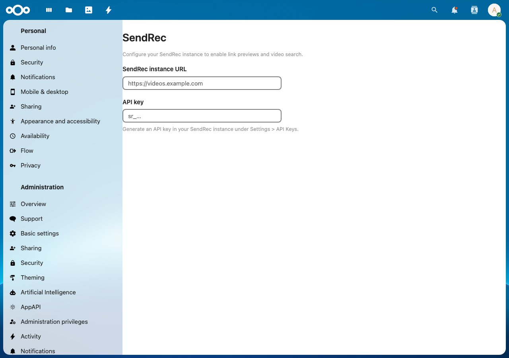

# SendRec integration for Nextcloud

Integrate your self-hosted [SendRec](https://sendrec.eu) instance with Nextcloud.



## Features

- **Link previews** — Paste a SendRec watch URL in Talk, Text, or Deck to see a rich card with thumbnail, title, and duration
- **Smart Picker** — Search your SendRec videos from anywhere in Nextcloud and insert a link
- **Navigation** — Quick link to your SendRec instance in the top bar

## Setup

1. Install from the [Nextcloud App Store](https://apps.nextcloud.com/apps/integration_sendrec)
2. Go to **Administration Settings > Connected accounts**
3. Enter your SendRec instance URL (e.g. `https://videos.example.com`)
4. Enter your SendRec API key — generate one in your SendRec instance under **Settings > API Keys**

## Requirements

- Nextcloud 28 or later
- A running SendRec instance (v1.26.0+) — [self-host with Docker](https://github.com/sendrec/sendrec/blob/main/SELF-HOSTING.md) or install via the [Unraid Community Apps template](https://github.com/sendrec/sendrec/blob/main/unraid-template.xml)

## SendRec configuration

To allow Nextcloud to embed SendRec watch pages, set the `ALLOWED_FRAME_ANCESTORS` environment variable on your SendRec instance:

```
ALLOWED_FRAME_ANCESTORS=https://your-nextcloud.example.com
```

## Development

```bash
# Install dependencies
npm ci
composer install

# Build frontend
npm run build

# Development mode (watch)
npm run dev
```

## License

AGPL-3.0 — see [LICENSE](LICENSE).
